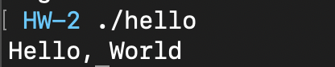
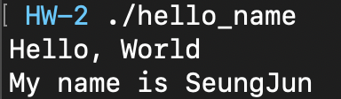
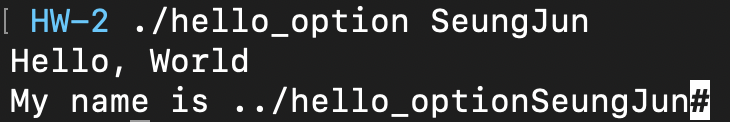

# GBC_Security: HW2 
> hello.asm 파일과 strlen.asm 파일을 컴파일하고 실행 해본 후 코드를 분석한 write-up 을 쓰세요.

# 파일 실행 
- hello.asm 파일 실행

    

- strlen.asm 파일 실행

    

# 코드 분석
<details>
<summary>hello.asm 코드</summary>
<div markdown="1">

```assembly
global    _start
section   .text
_start:
    mov       rax, 1    
    mov       rdi, 1
    mov       rsi, message
    mov       rdx, 13
    syscall
    mov       rax, 60
    xor       rdi, rdi
    syscall
    section   .data
message:
    db        "Hello, World", 10
```
</div>
</details>

---
```assembly
global    _start
section   .text
_start:
```
코드를 보면 맨 처음에 보이는 것이 `global   _start` 이다. 

이는 `_start`라는 함수를 전역에서 접근가능하도록 하겠다는 명령어이다.

그 다음에 보이는 것이 `section  .text`인데 어셈블리어 프로그램에는 대부분 `데이터 영역` 과 `텍스트 영역`이 있다. 데이터 영역은 말 그대로 프로그램에서 사용할 데이터들을 모아놓는 영역이고 텍스트 영역에서 작성한 코드로 프로그램이 실행된다.

이제 `_start` 함수를 들여다 보자. 함수를 보면 처음부터  `mov`라는 instruction이 여러번 등장한다. instruction의 구조는 `mov <dest> <src> `로 이루어져 있으며 직관적으로 봐도 알 수 있듯이 `<src>`를 `<dest>`로 옮기는 instruction이다. 그렇다면 위의 `mov`instruction도 동일할 것이다.

```assembly
    mov       rax, 1    ; 1을 rax register에 저장 
    mov       rdi, 1    ; 1을 rdi register에 저장 
    mov       rsi, message  ; message라는 data를 rsi regsiter에 저장
    mov       rdx, 13   ; 13을 rdx register에 저장 
```
피상적으로 봤을 때는 위의 코드는 아무 의미가 없는 코드이다. ~~우리를 괴롭히려고 넣은게 분명하다.~~ 하지만 그 다음 instruction을 보면 위의 작업이 왜 필요한지 알게 될 것이다.
```assmebly
syscall
```
[Linux System call table](https://blog.rchapman.org/posts/Linux_System_Call_Table_for_x86_64/) 을 살펴보면 rax register를 1로 초기화 시키는 것은 syscall에서 sys_write를 사용한다는 뜻이다. 

|%rax|System call|%rdi|%rsi|%rdx|
|:---:|:---:|:---:|:---:|:---:|
|1|sys_write|unsigned int fd|const char *buf|size_t count|

(sys_write는 C언어의 write()함수와 동일한 기능을 한다고 생각하면 편할 것이다.)

이 사실을 알고 나서 위의 `mov` instcutions를 보면 왜 굳이 위의 작업을 했는지 알 수 있을 것이다. sys_write를 하기 위해 rax register를 1로, rdi register를 unsigned int인 1로, rsi register를  출력할 data인 message로, rdx register에는 message의 크기인 13으로 초기화 시켜준 것이다. 

이렇게 세팅을 하고 `syscall`을 했기 때문에 문서 상단의 파일 실행 결과와 같이 `Hello, World`가 터미널로 출력되는 것이다.

이제 마저 남은 instruction들을 살펴보자.
```assembly
    mov       rax, 60
    xor       rdi, rdi
syscall
``` 
rax를 60, rdi에는 rdi XOR rdi 결과 즉, `1 XOR 1 = 0`으로 초기화 시켜주었다.


[table](https://blog.rchapman.org/posts/Linux_System_Call_Table_for_x86_64/)을 보면 알겠지만 rax를 60으로 초기화하는 것은 sys_exit을 한다는 것이다. 

|%rax|System call|%rdi|
|:---:|:---:|:---:|
|60|sys_exit|int error_code|

sys_exit으로 설정을 하고 syscall을 한 번 더 했기 때문에 프로그램이 정상적으로 종료될 수 있었던 것이다. 
~~즉, 쓸 데 없이 우리를 괴롭히려고 작성한 코드는 하나도 없었다. 외쳐 갓찬솔~!!~~

이렇게 프로그램은 끝나지만 파일에는 남아있는 코드들이 있다.
```assembly
section   .data
message:
    db        "Hello, World", 10
```
아까 위에서 잠시 언금한 data 영역에 관한 코드이다. 프로그램에 사용할 data인 `"Hello, World"`라는 문자열을 message라는 변수로 지정해서 data 영역에 저장해둔 것이다. 

더 자세히 살펴보자면 db는 데이터 탑입인 byte를 의미하는 것이고 10은 개행문자(줄바꿈 문자)이다.

이로써 우리는 hello.asm 코드를 샅샅이 파헤쳐 보았다.

---
strlen.asm 코드는 hello.asm 코드보다 좀 더 복잡하다. 하지만 괜찮다. hello.asm을 볼 때보다 기본지식은 더 많기 때문이다.

---

<details>
<summary>strlen.asm 코드</summary>
<div markdown="1">

```assembly
BITS 64

section .text
global _start

strlen:
    mov rax,0                  
.looplabel:
    cmp byte [rdi],0           
    je  .end                    
    inc rdi                     
    inc rax                    
    jmp .looplabel            
.end:
    ret                      
    
_start:
    mov   rdi, msg              
    call  strlen
    add   al, '0'               
    mov  [len],al            
    mov   rax, 1           
    mov   rdi, 1          
    mov   rsi, len       
    mov   rdx, 2        
    syscall           
    mov   rax, 60    
    mov   rdi, 0    
    syscall        

section .data
    msg db "hello",0xA,0        
    len db 0,0xA         
```
</div>
</details>

---
하지만 당황스럽게도 코드의 첫줄에는 또 모르는 코드가 나온다.
`BITS 64` 하지만 당황하지 말고 단순히 64bit 프로그램을 의미한다는 정도로만 알아두고 넘어가자.

그 다음에는 다행히도 우리의 기본 상식을 사용하는 것들이 나온다.
```assembly
section .text
global _start

strlen:
...
_start:
...
```
text 영역에 코드가 작성되어 있으며 `global`로 _start 함수를 전역으로 접근가능하게 하였다. 그리고는 strlen 함수와 _start함수에 대한 코드들이 나타난다.

먼저 strlen 함수를 살펴보자.
```assembly
strlen:
    mov rax,0           ; rax register에 0을 저장 (sys_read)           
.looplabel:
    cmp byte [rdi],0    ; rdi의 값과 0을 비교하여 Flag register에 저장      
    je  .end            ; <op1> == <op2>이면 .end로 이동 
    inc rdi             ; rdi 값을 1 증가 (byte)
    inc rax             ; rax 값을 1 증가 (byte)
    jmp .looplabel      ; .looplabl로 이동 
.end:                   
    ret                 ; return
```
주석만으로는 `mov rax,0` 부분이 이해 되지 않을 수 있다. 하지만 후반부에 자연스럽게 이해되리라 믿으면서 다음으로 넘어가려 한다. 

이제 살펴볼 것은 _start 함수이다.
```assembly
_start:
    mov   rdi, msg      ; rdi에 msg를 저장              
    call  strlen        ; strlen 호출 
    add   al, '0'       ; al = al + '0'           
    mov  [len],al       ; len 에 al을 저장      
    mov   rax, 1        ; rax에 1을 저장 (sys_write)
    mov   rdi, 1        ; rdi에 1을 저장 
    mov   rsi, len      ; rsi에 len을 저장 
    mov   rdx, 2        ; rdx에 2를 저장 
    syscall             ; wirte
    mov   rax, 60       ; rax에 60을 저장 (sys_exit)
    mov   rdi, 0        ; rdi에 0을 저장 
    syscall             ; exit
```
코드에 주석을 달았지만 추가설명이 필요할 것 같다. strlen 함수를 호출하기 전에 rdi msg를 저장하였다. 그리고 strlen 함수 처음은 `mov rax, 0`이다. ~~즉, strlen 함수는 msg를 읽는 것이다.~~ 

```
section .data
    msg db "hello",0xA,0        
    len db 0,0xA         
```
참고롤 msg에는 "hello"라는 문자열과 개행문자, 0이 저장되어 있다.

이 상태에서 다시 strlen 함수를 살펴보자. 
```assembly
strlen:
    mov rax,0           ; rax register에 0을 저장 (sys_read)           
.looplabel:
    cmp byte [rdi],0    ; rdi의 값과 0을 비교하여 Flag register에 저장      
    je  .end            ; <op1> == <op2>이면 .end로 이동 
    inc rdi             ; rdi 값을 1 증가 (byte)
    inc rax             ; rax 값을 1 증가 (byte)
    jmp .looplabel      ; .looplabl로 이동 
.end:                   
    ret                 ; return
```
rdi에는 `hello`라는 문자열이 저장되어 있으며 strlen 함수가 시작되면 rdi가 0이 될 때까지 즉, rdi의 값이 hello 문자열과 개행문자를 지나 0을 가리킬 때 까지 rax를 1씩 더하는 것이다. ~~msg를 읽는 함수도 아니였던 것이다.~~

strlen 함수가 종료되면 rdi에는 0이, rax에는 hello + 개행문자의 길이인  6이 저장 되어 있을 것이다. 이제 다시 _start 함수를 이어서 살펴보자.
```assembly
_start:
    mov   rdi, msg      ; rdi에 msg를 저장              
    call  strlen        ; strlen 호출 
    add   al, '0'       ; al = al + '0'           
    mov  [len],al       ; len 에 al을 저장      
    mov   rax, 1        ; rax에 1을 저장 (sys_write)
    mov   rdi, 1        ; rdi에 1을 저장 
    mov   rsi, len      ; rsi에 len을 저장 
    mov   rdx, 2        ; rdx에 2를 저장 
    syscall             ; wirte
    mov   rax, 60       ; rax에 60을 저장 (sys_exit)
    mov   rdi, 0        ; rdi에 0을 저장 
    syscall             ; exit
```
al은 rax register의 lowest 8-bit를 가리키는 것이다. al에 '0'을 더하여 len에 al 값을 저장하였다. 그러면 이제 len에는 아마 '6'이 저장되어 있을 것이다.
이 다음부터는 hello.asm과 비슷하다. sys_write를 위한 사전작업을 해준 뒤 len의 결과를 출력하고 프로그램은 종료된다.

이로써 우리는 strlen.asm 의 코드들도 모두 살펴보았다.

---
>hello.asm 을 업그레이드 하세요.
```
Hello, World
My name is {자신의이름}
```
<details>
<summary>hello_name.asm 코드</summary>
<div markdown="1">

```
 global    _start
section   .text
_start:
    mov       rax, 1
    mov       rdi, 1
    mov       rsi, message
    mov       rdx, 34
    syscall
    mov       rax, 60
    xor       rdi, rdi
    syscall
    section   .data
message:
    db        "Hello, World", 10
    db        "My name is SeungJun", 10
```
</div>
</details>

- 실행 결과 



---

>hello.asm 업그레이드(2) (옵션)
>>사용자가 인자를 입력하면 예를들어서 ./hello chansol 입력하면 다음과 같이 출력할 수 있도록 만드세요.
```
Hello, World
My name is chansol
```
~~제가 하긴 했는데 제가 한 건 아닙니다...~~~
<details>
<summary>hello_option.asm 코드</summary>
<div markdown="1">

```assembly
; Disassembly of file: hello_option.o
; Tue Jan  5 23:25:26 2021
; Type: Mach-O Little Endian64
; Syntax: NASM
; Instruction set: 8086, x64

default rel

global _main

extern _write                                           ; near
extern _printf                                          ; near


SECTION ._TEXT.__text align=16 execute                  ; section number 1, code

_main:  ; Function begin
    push    rbp                                     ; 0000 _ 55
    mov     rbp, rsp                                ; 0001 _ 48: 89. E5
    sub     rsp, 32                                 ; 0004 _ 48: 83. EC, 20
    mov     dword [rbp-4H], edi                     ; 0008 _ 89. 7D, FC
    mov     qword [rbp-10H], rsi                    ; 000B _ 48: 89. 75, F0
    mov     edi, 1                                  ; 000F _ BF, 00000001
    lea     rsi, [rel _main+33H]                    ; 0014 _ 48: 8D. 35, 00000033(rel)
    mov     edx, 13                                 ; 001B _ BA, 0000000D
    call    _write                                  ; 0020 _ E8, 00000000(rel)
    mov     rcx, qword [rbp-10H]                    ; 0025 _ 48: 8B. 4D, F0
    mov     rsi, qword [rcx+8H]                     ; 0029 _ 48: 8B. 71, 08
    lea     rdi, [rel _main+28H]                    ; 002D _ 48: 8D. 3D, 00000028(rel)
    mov     qword [rbp-18H], rax                    ; 0034 _ 48: 89. 45, E8
    mov     al, 0                                   ; 0038 _ B0, 00
    call    _printf                                 ; 003A _ E8, 00000000(rel)
    xor     r8d, r8d                                ; 003F _ 45: 31. C0
    mov     dword [rbp-1CH], eax                    ; 0042 _ 89. 45, E4
    mov     eax, r8d                                ; 0045 _ 44: 89. C0
    add     rsp, 32                                 ; 0048 _ 48: 83. C4, 20
    pop     rbp                                     ; 004C _ 5D
    ret                                             ; 004D _ C3
; _main End of function


SECTION ._TEXT.__cstring align=1 noexecute              ; section number 2, data

        db 48H, 65H, 6CH, 6CH, 6FH, 2CH, 20H, 57H       ; 004E _ Hello, W
        db 6FH, 72H, 6CH, 64H, 0AH, 00H, 4DH, 79H       ; 0056 _ orld..My
        db 20H, 6EH, 61H, 6DH, 65H, 20H, 69H, 73H       ; 005E _  name is
        db 20H, 25H, 73H, 0AH, 00H                      ; 0066 _  %s..
```

</div>
</details>

- 실행결과


- 제가 한 것: 미완성 코드
<details>
<summary>my_hello.asm 코드</summary>
<div markdown="1">
BITS 64
global _start
extern printf
section     .text 

_start:
    mov       rax, 1
    mov       rdi, 1
    mov       rsi, message
    mov       rdx, 26
    syscall
    push    rbp 
    mov     rbp, rsp 
    add     rsp, 16
    mov     rax, [rbp+16]
    push    word[rax]
    mov     rsi, rax 
    mov     rax, 1
    mov     rdi, 1
    mov     rdx, 24
    syscall
    mov     rax, 60
    mov     rdi, 0                                                                                                                             
    syscall

section     .data 
message:
    db        "Hello, World", 10, "My name is "

</div>
</details>

- 실행결과 


