# GBC Security HW 3

> 자신의 실험 결과에 대한 write-up 을 쓰세요.
>> 사람은 어떤 학문을 이해하든지 간에 그 학문이 정말로 맞는지 확인하기 위해 자신만의 실험을 하기 마련이다. 특히 컴퓨터 공학은 그러한 실험이 많이 일어나는데 어제의 내용과 오늘의 내용을 이해하기 위해서 자신이 했던 생각이나 의문이나 고민을 write-up 에 작성하고 그 생각과 의문과 고민을 해결하기 위해서 시도했던 실험과 실험 결과를 write-up 에 작성하시오.

---

1. 고민
    - Virtual memory에서 Stack 영역과 Heap 영역은 절대로(거의) 만나지 않게 하기 위하여 Stack 영역과 Heap 영역 사이에 빈 공간을 크게 두었다.
    
    - unallocated memory의 크기가 실제로 얼마나 되며 그 공간을 다 채우기 위해서는 얼마나 큰 데이터가 필요한지 알아보자!

2. 변질
    - `unallocated memory의 크기가 실제로 얼마나 되며 그 공간을 다 채우기 위해서는 얼마나 큰 데이터가 필요한지 알아보자!`...라고 계획했으나...

<details>
<summary>stack_heap 코드</summary>
<div markdown="1">

```c
#include <stdio.h>
#include <stdlib.h>

int data_variable = 7;
int bss_vairable = 0;

int main() {
    int stack_variable = 57;
    int* heap_variable = (int *)malloc(sizeof(int));

    printf("Stack memory address:\t%p\n", &stack_variable);
    printf("Heap memory address:\t%p\n", heap_variable);
    printf("bss memory address:\t%p\n", &bss_vairable);
    printf("Data memory address:\t%p\n", &data_variable);
}
```
</div>
</details>

- 실행 결과 
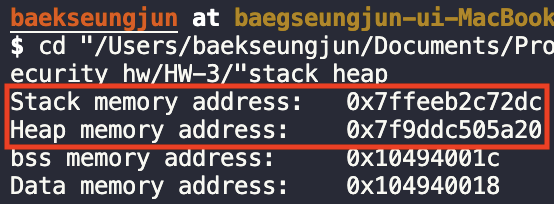

...... 왜 stack 영역과 heap 영역의 차이가 왜 저거 밖에 안되는거지...?

도저히 이해할 수 없는 결과가 나와버렸다...
처음에는 heap 변수를 잘못 선언한 줄 알았지만 그건 문제가 아니였다. 

- 그래서 왜 저런 결과가 나왔는지 파헤쳐보려 한다.

---

3. 본격적인 실험 
- 우선 저런 결과를 도출하게 한 가능성들 하나씩 제거해보려 했다. 
- 가능성 1: OS의 차이
    1. window os에서 실행 
    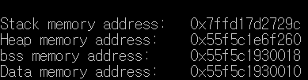
    정상적인(?) 결과가 나오는 것을 확인할 수 있다.
    2. linux os에서 실행 
    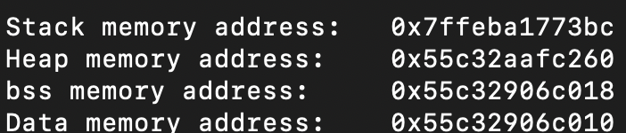
    window os에서 실행한 것과 거의 동일한 것을 알 수 있다.
    3. mac os에서 실행(터미널)
    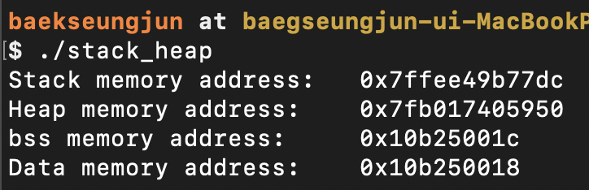
    비정상적인(?) 결과가 발생한 것을 알 수 있다...

그렇다면 정말 os 차이일까..? 그렇다면 mac os는 왜 virtual memory에서 stack 영역과 heap 영역의 차이를 적게 하여 둔 것일까?

- 혹시나 os가 원인이 아닐 수도 있어 다른 실험도 해봤다.
- 가능성 2: editor 차이
    1. vscode에서 실행
    

    2. xcode에서 실행 
    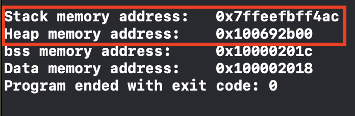
    신기하게도 본인이 가장 원하는 모범답안이 xcode의 실행결과에서 나타났다. 

    3. repl.it에서 실행 
    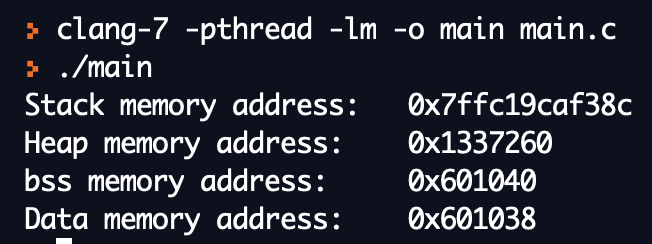
    repl.it에서도 역시 정상적인 결과가 나타난 것을  확인할 수 있다.

하지만 editor의 차이일 리는 없다... vscode가 아니라 terminal에서 실행햇을 때도 동일한 결과가 나왔기 때문이다. 구글링을 해보던 중 다음과 같은 설명을 발견할 수 있었다. 
> 이러한 가상메모리 기술은 사용자가 신경 쓸 필요 없이 OS 측에서 자동으로 작동하며 사용자가 프로세스를 올리고 내림에 있어서 역시 사용자가 신경 쓸 필요 없이 OS의 가상메모리를 활용하여 자동으로 메모리 관리를 위임할 수 있다는 장점이 있다.

이 말을 통해 os가 가상 메모리를 자동적으로 작동시키는 것을 알 수 있다.

그래서 이것이 정말인지 확인하기 위해 실험을 하나 더 해봤다. 
- 승화님의 mac os 실행결과 
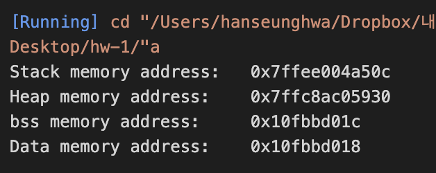
혹시나 했는데 역시나 비정상적인 결과가 도출되는 것을 알 수 있다.

그래서 os의 차이라고 가정하고 mac os에서는 어떻게 virtual memory를 설정하는지 알아보려고 한다.

- 일단 heap 영역과 stack 영역의 차이가 얼마인지 살펴보자.
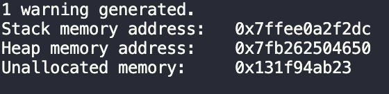
실험 결과 `0x131f94ab23`이 나왔으므로 10진수로는 82134215459, 약 82GB이다. 물론 82GB도 엄청나게 큰 단위이지만 본인이 질문의 답을 들었을 때 정도로 놀라울 정도로 큰 것은 아니다. 

- stack 영역은 다른 os의 virtual memory와 거의 동일하게 자리 잡고 있다. 문제는 heap 영역이다. 그렇다면 heap 영역의 메모리를 많이 차지하면 어떻게 될까? 

<details>
<summary>stack_heap 코드</summary>
<div markdown="1">

```c
#include <stdio.h>
#include <stdlib.h>

int data_variable = 7;
int bss_vairable = 0;

const int MAX = 1e10;

int main() {
    long long stack_variable = 57;
    long long** h_arr = (long long**)malloc(sizeof(long long*)*MAX);
    for(int i=0; i<1000; i++)
        h_arr[i] = (long long*)malloc(sizeof(long long)*MAX);

    long long* heap_variable = (long long *)malloc(sizeof(long long)*MAX);

    printf("Heap memory address:\t%p\n", heap_variable);
    printf("Heap memory address:\t%p\n", h_arr);
    printf("Stack memory address:\t%p\n", &stack_variable);
    printf("Unallocated memory:\t%p\n", &stack_variable-heap_variable);
}
```

</div>
</details>

공간을 많이 차지하도록 long long 이차원 배열로 변수를 잡아 주었다. `long long` type 1e10개를 가지는 배열을 1000개 가지는 배열을 선언하였다. 
- for:1000
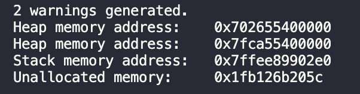
신기하게도 공간을 많이 차지하게 변수를 설정했지만 unallocated memory의 공간은 줄어들지 않았다. 
- for: 5000
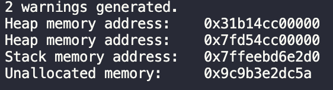
이상하게도 공간을 더욱 많이 차지하도록 했는데 unallocated memory는 더 늘어났다...그런데 더 신기한 것은 heap memory의 시작점이 눈에 띄게 low address로 이동했다는 것이다. (address의 앞자리가 7에서 3으로 이동)
- for: 8000
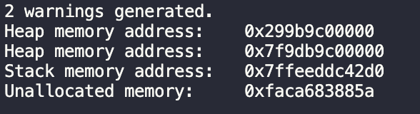
unallocated memory 영역은 아까와 비슷하지만 address가 더 밑으로 간 것을 알 수 있다.
- for: 10000
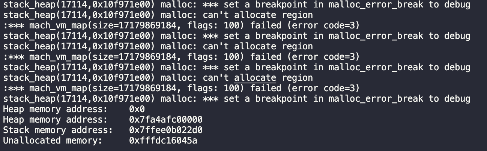
10000번 정도 반복문을 돌리니 신기한 결과가 나왔다. 알 수 없는 오류들과 함께 Heap memory의 시작이 0x0이 된 것이다... ~~머선129~~

메모리 공간을 너무 많이 차지한 건가 싶어 heap 영역에서 차지한 memory가 얼마나 되는지 계산해보았다. 
간단하게 설정하면 `long long`의 크기가 8byte, 이것을 크기 1e10인 배열을 10000개 가진다고 했고 `8*1e10*10000' = 800000000000000이 나왔고 GB로 변환을 하면 약 800000GB, TB로 변환하면 858TB 이다... 그렇다면 이게 heap 영역의 최대 크기인걸까...? 정확하게 for문의 몇번째부터 오류가 난 것인지 확인해본 결과 8190번까지는 정상적으로 메모리 할당을 하는 것을 확인할 수 있었다. 
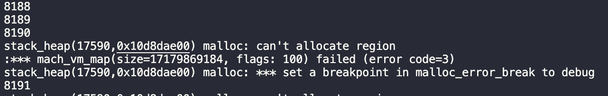
이를 TB로 계산하니 약 734TB이며 이 것이 가상 메모리에서 heap 영역이 최대로 가질 수 있는 memory 크기인 것을 알 수 있다. 

4. 정리
- 정리를 하기 위해 다음과 같은 코드를 작성하여 virtual memroy의 구조를 알아보았다. 
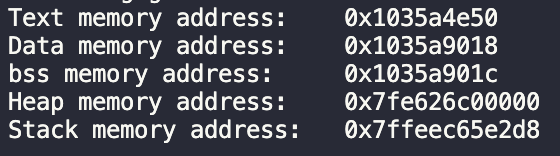
- 실험을 통해 우리는 다음과 같은 몇가지 사실을 알 수 있었다. 
    1. 가상 메모리는 OS에서 자동으로 관리해주는 것이므로 OS마다 다를 수 있다.
    2. 실제로 mac os는 우리가 아는 방식과는 다르게 가상메모리를 설정했다. 
        - Heap 영역과 Stack영역 사이의 빈 공간 즉, unallocated memory가 생각보다 좁았다.
        - 대신 Heap memory 와 bss memory 사이의 공간이 우리가 배웠던 unallocated memory 크기만큼 컸다. 
        - Heap 영역에서 memory 크기를 아무리 많이 차지하게 해도 Heap영역과 Stack 영역 사이의 크기는 일정하게 유지되었다. 
            - 대신 Heap영역의 시작 주소가 앞으로 당겨졌다. 
    3. 그림으로 정리 
        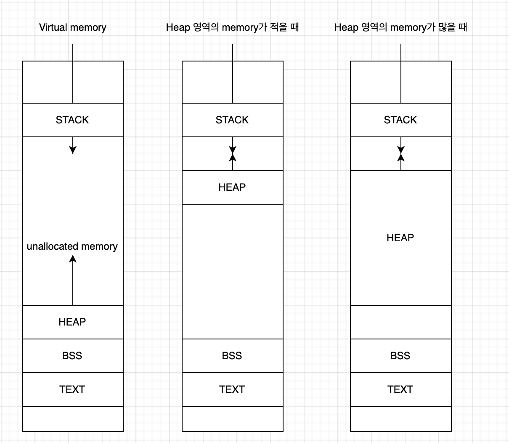
    4. Heap 영역이 최대로 가질 수 있는 크기, unallocated의 크기는 약 734TB이다. 이는 약 1/4 네이버 데이터센터 용량이다. 한 프로그램에서 메모리를 이만큼 사용하는 프로그램이 있을까 싶다...

    어쨌거나 배운대로 Stack 영역과 Heap영역이 만날일은 절대 없을 것이다...

