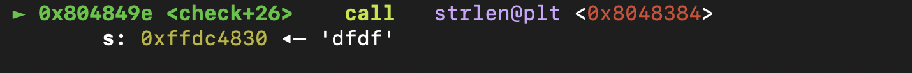

# GBC Security HW: crackme0x04

## 풀이 
- ### 파일 정보 확인 

32-bits file인 것을 확인할 수 있다.

---

- ### function 확인 

프로그램에 main 함수와 check 함수가 있을 것으로 추정된다.

---

- ### 프로그램 실행 

'IOLI Crackme Level 0x04' 가 출력 됨. ~~별로 중요한 게 아니다.~~~

'Password: ' 가 출력됨. ~~이것 또한 별로 중요한 게 아니다.~~

Password를 입력해야 하는 명령줄이 나왔다. 비밀번호를 알아내기 위해서 일단  아무거나 넣어봤다. (dfdf를 넣음)

check 함수에 인자를 입력한 비밀번호인 'dfdf'로 주어 넘어가는 것을 확인할 수 있다. 

check 함수 안에서 'dfdf'를 strlen에 넣는 것을 확인할 수 있다. 

strlen 후에 `cmp dword ptr [ebp-0xc], eax` 를 실행 하는 것을 확인할 수 있다. 그리고 비교후에 `[ebp-0xc] >= eax` 이면 check+199로 넘어가는 것을 확인할 수 있다. 

eax에는 무엇이 있고 dword ptr [ebp-0xc]에 무엇이 있길래 둘을 비교하는지 확인해 보았다. 

eax에는 4, [ebp-8]에는 0이 있는 것을 확인할 수 있다. 

`ni`로 instruction들을 하나씩 넘어가다보면 sscanf()를 call하는 것을 확인할 수 있다.

>문자열에서 형식화 된 데이터를 읽어온다. str 에서 데이터를 형식 문자열(format)에서 지정하는 바에 따라 읽어와 그 데이터를 뒤에 부수적인 인자들이 가리키는 메모리 공간에 저장하게 된다. 이 때, 데이터가 저장되는 방식 역시 형식 문자열에 의해 결정된다.

dfdf의 'd' 하나를 정수형으로 sscanf()에 넣은 것을 확인할 수 있다. 

[ebp-8]과 0xf를 비교하여 같지 않으면 check+112로 넘어가는 것을 확인할 수 있다. 

[ebp-8]에 사진과 같은 수가 저장되어 있는 것을 확인할 수 있다. 아무튼 0xf와는 같지 않으므로 check+112로 넘어가게 된다.

eax를 1 증가한 후 check+20으로 넘어가게 된다. 

다시 eax와 [ebp-0xc]를 비교한다. 

[ebp-0xc]에는 1, eax에는 4가 저장되어 있었다. 
0에서 1로 변한된 것을 보니 아까 inc instruction에서 더해진 것이라 추정된다. 즉 계속 증가하여 4가 되면 반복문을 탈출할 것이라 추정했다.

다시 sscanf()로 가서 `0xffdc47fb`의 값을 정수형으로 읽는 것으로 확인할 수 있다. 

확인해보니 'f'였다. `dfdf`의 f를 읽는 것이였다. 

다시 [ebp-8]과 0xf를 구분해서 같지 않으므로 check+112였다. 
확인해보니 [ebp-8]은 0x80이였다.

이것을 계속 반복한다. 
아무튼 계속하다보니 틀린 것을 알게 되었다. 

아직 이해를 잘 못했지만 알아낸 것이 몇 개 있었는데 

   - 분기는 `cmp dword ptr[ebp-8], 0xf` 인 것
   - check 함수에서 입력한 비밀번호를 정수형으로 하나씩 읽는다는 것 
   - 그렇다면 비밀번호는 아마 정수일 확률이 높을 것이다. 

3456을 비밀번호로 하여 다시 해보았다.

분기에서 다시 확인을 해보니 

처음에 sscanf()에 들어간 3이 저장되어 있는 것을 알 수 있었다. 

한번 더 반복문을 돌아 분기를 확인하니 

7이었다. 
이를 통해 3에 4를 더해 7이 된 것을 확인할 수 있었다. 
~~사실 이전에 add instruction이 있길래 그럴거라 예측했지만 이걸통해 확실해졌다.~~

그리고 분기의 진정한 의미도 알게 되었다. 
비밀번호를 앞에서부터 하나씩 sscanf()로 정수형으로 읽어서 계속 더한 것이 15와 같으면 분기의 흐름이 변경될 거라 예측했다. 

그래서 비밀번호를 각 digit의 합이 15라고 예측하고 password를 87로 입력하니 

정답이었다..... 

~~이 집 보안 잘 하네,,,~~

---