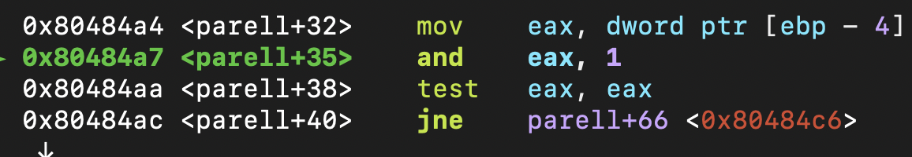

# GBC Security HW: crackme0x05

## 풀이 

- ### 파일 정보 확인 

32bit 파일인 것을 확인할 수 있다.

- ### function 확인 

4번과는 다르게 parell 함수가 추가로 있는 것을 확인할 수 있다. 

- ### 프로그램 실행 

비밀번호로 아무 값이나 넣은 뒤 분기를 찾아 보았다. (12456)

sscanf()가 나오는 것을 보아 4번이랑 비슷할 것이라고 직감적으로 예측했다.

`ni`로 한줄씩 내려가다보니 분기를 찾을 수 있었다. 이번에는 0x10, 즉 비밀번호의 합이 16인 것이였다. 

12456은 합이 16이 안되므로 합이 16인 97을 넣고 다시 실행 해보았다. 

분기의 흐름이 바껴 check+99로 넘어가지 않고 다음 줄이 실행되었다.
그리고 parell 함수를 call하는 것이 보였다. 

97을 parell 함수의 인자로 넘기는 것을 확인할 수 있다. 

parell 함수에서도 sscanf()를 사용했으며 97을 정수형으로 읽어들이는 것을 확인할 수 있었다. 

계속 한 줄 씩 읽다보니 `test eax, eax`가 나왔고 '직감적으로 합이 16이되, ~~각 자릿수가 같은 것~~ 이여야 하는구나!'를 느꼈다. 
(test instruction은 op1과 op2를 and 연산 하는 것이다. )

그래서 이번에는 88을 비밀번호로 넣어봤다. 

와...정답...~~직감적으로 맞춘거긴 하지만 진짜 뿌듯했다...~~

정확한 풀이를 위해 좀 더 파헤쳐 보았다. 

parell의 분기는 

`test eax, eax` 였다. eax에는 비밀번호인 88이 16진수로 넣어져 있었고
`and eax, 1`을 거쳐 test로 가는 것이였다. 

여기서 든 의문점은 `and 88, 1`이 왜 0이냐는 것이다. 

간단하게 프로그램을 작성하여 확인해봤더니 진짜 0이 나왔다. 

x & 1을 2진수 계산으로 해보니 마지막 bit가 0이면 0, 1이면 1을 출력했다.~~어찌보면 당연한 거~~

그렇다면 마지막 수가 짝수(마지막bit가 0)이면서 각 digit의 합이 16인 수가 비밀번호라는 뜻이다.

그래서 12364를 넣어보니 정답이였다...

~~이 집 진짜 보안 맛돌이다...~~
