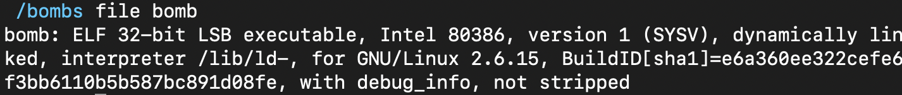
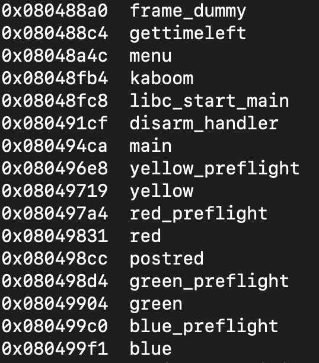
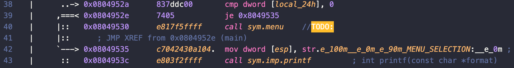
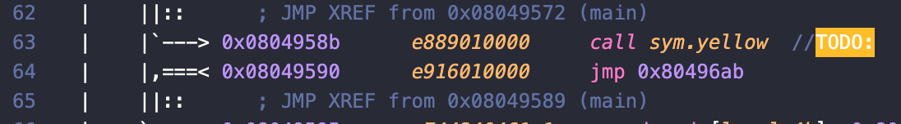
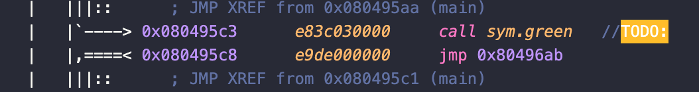
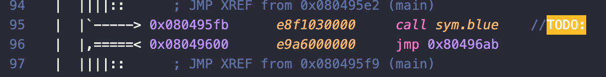
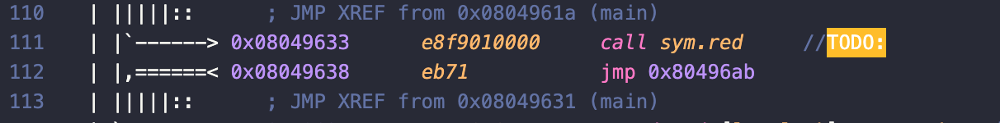
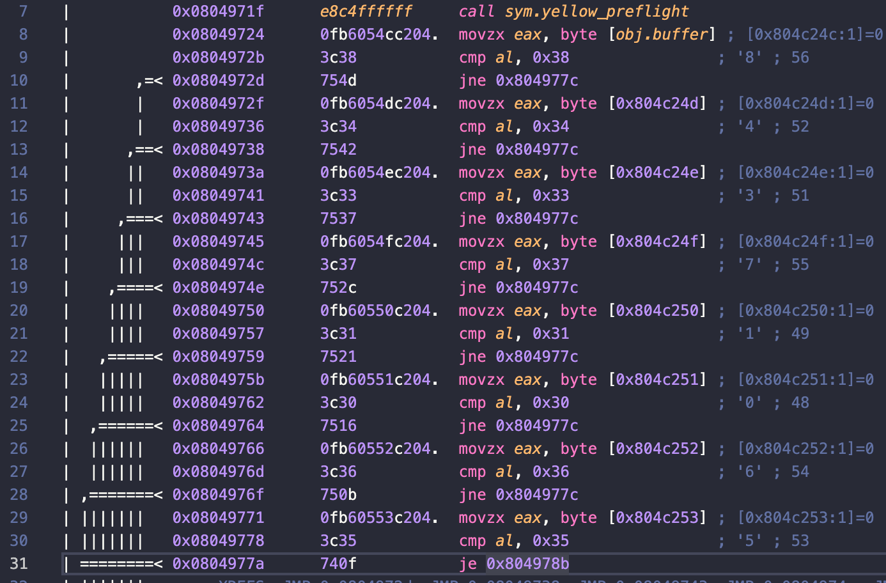
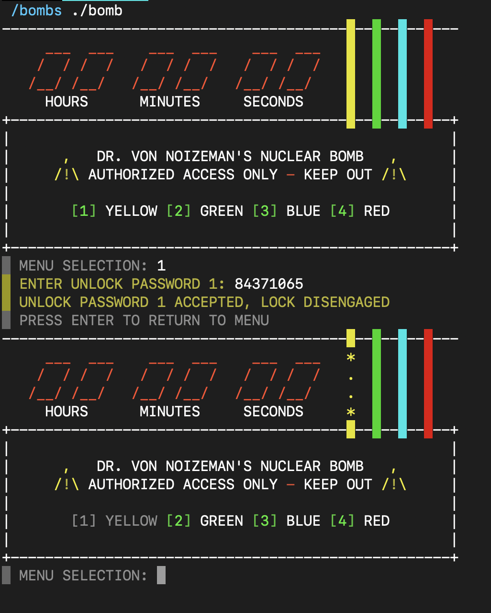

# GBC Security HW: Bomb

- ## 공통 작업 
    - 파일 정보 확인 

    

    - function 확인 

    

    main, yellow, red, green, blue 등의 함수가 있음을 알 수 있다. 

    - main function 확인 

    프로그램 실행과 r2로 main function의 전체적인 흐름을 확인. ~~(지구 하나 폭발)~~

    

    menu function을 call 한 후 입력에 띠라 

    

    

    

    

    yellow, green, blue, red function을 call 하는 것을 확인할 수 있다. 

---

- <h2 style="color:yellow;">Yellow</h2>

    - yellow function 

    `s sym.yellow` 로 이동하여 `pdf`로 yellow function을 확인해보았다. 

    

    yellow function에서 yellow_preflight function을 call하는 것을 확인할 수 있다. (아마 저기서 암호를 입력하나보다...)

    입력 후에 buffer의 문자열을 0x38, 0x34, 0x33, 0x37, 0x31, 0x30, 0x36, 0x35와 차례로 비교하는 것을 확인할 수 있다. 

    r2는 정말 친절하게도 16진수를 10진수로 나타내줄 뿐만 아니라 아스키 코드로도 나타내주었다. 

    그리고 저 문자열`(84371065)`이 왠지 암호일 것 같은 느낌이 들었다. 

    확인 결과...
    
    

    정답이였다... ~~(다행히도 지구를 하나만 폭발시키고 노란선을 제거할 수 있었다...)~~

    암호풀이를 해보니 입력한 문자열을 한 바이트씩 가져와 비교하는 방식이었다. 

---

- <h2 style="color:blue;">Blue </h2>    
