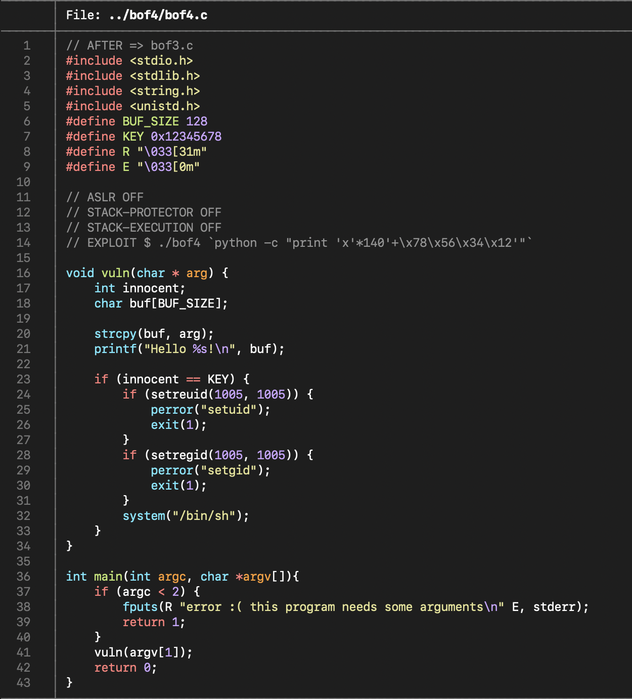
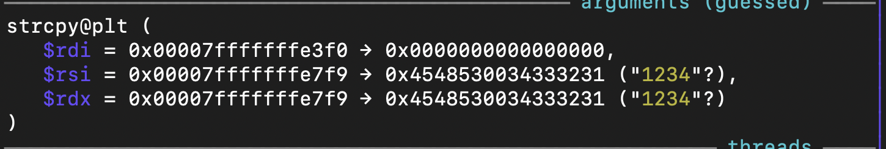
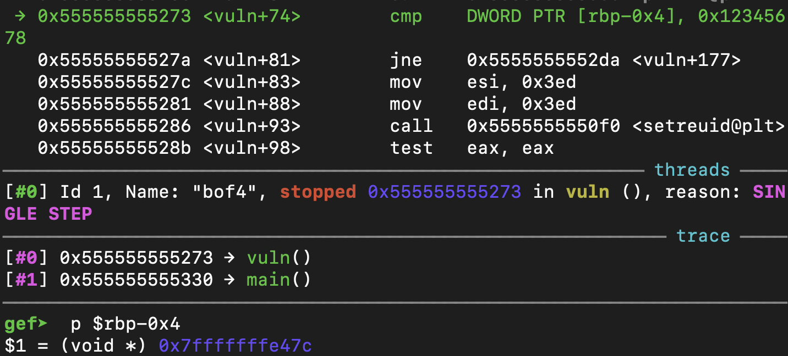
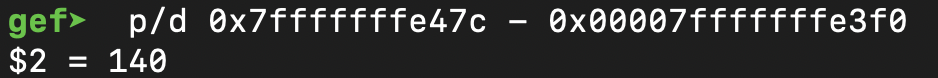
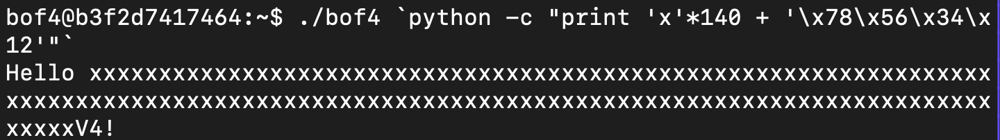
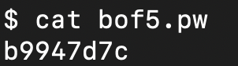
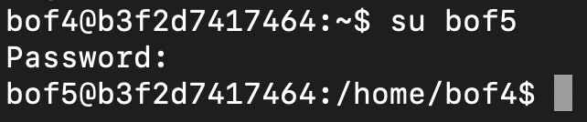

# GBC Seucrity HW: BOF4 Write-up

bof4.c file을 통해

- `system("/bin/sh");`에 도달하기 위한 분기는 `if (innocent == KEY)` 라는 것
- KEY 값은 '0x12345678` 이라는 것
- 입력 방식은 파일을 실행할 때 buffer로 받아 vuln() 함수의 strcpy()에서 argumentFh 넘겨주는 것 

**그러므로 bufferoverflow를 하기 위해서는 innocent의 위치와 입력 받는  위치를 알아내야 한다.**

- buffer의 위치 

gdb로 파일을 열어 vuln()의 strcpy() 위치로 가면 rdi의 메모리 주소 값(buffer 위치)을 알 수 있다. 

- inncoent의 위치  

innocent와 KEY를 비교하는 부분인 cmp instruction으로 가서 `rbp-0x4`의 메모리 주소를 알아낸다. 

두 메모리 주소의 차를 구하여 버퍼 크기가 140임을 알 수 있다. 

이제 모든 것을 알아냈으니 프로그램을 실행하여 쓰레기값으로 140 bytes를 채워주고 Key 값을 little endian으로 입력하여준다. 

정상적으로 bufferoverflow를 하여 셀 실행이 되었고 `cat bof5.pw`를 통해 bof5의 비밀번호를 알아낼 수 있다. 

이제 bof5 유저 접속을 하여 알아낸 비밀번호를 입력하면 bof5 유저로 접속이 된다. 

[BOF5:](https://github.com/HDSeungJun/gbc_security_hw/blob/main/HW-6/bof5.md)
