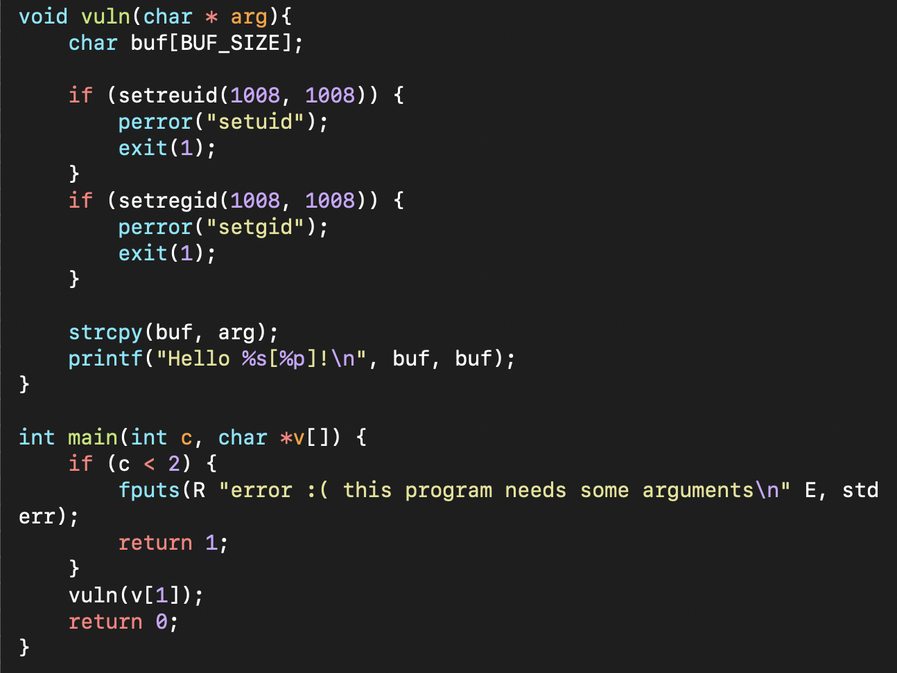
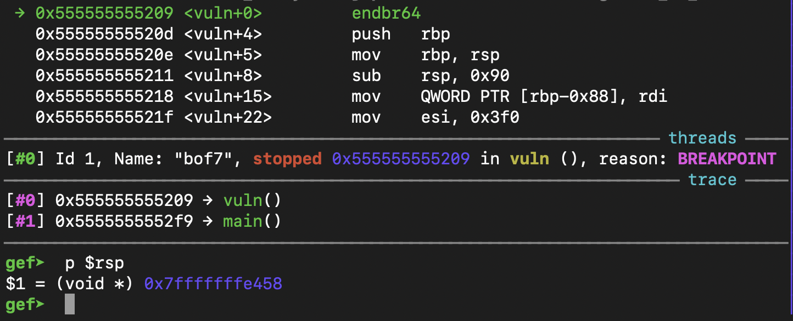
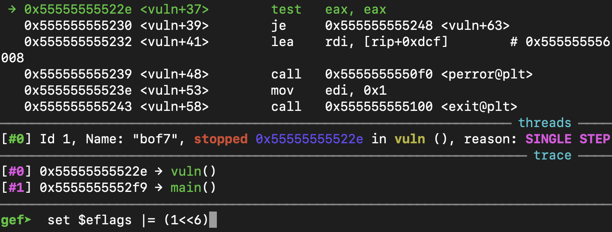
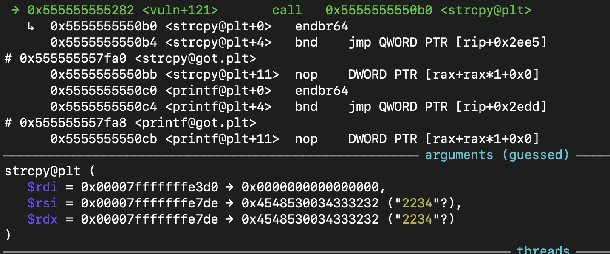
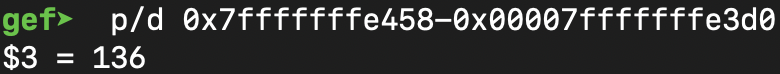
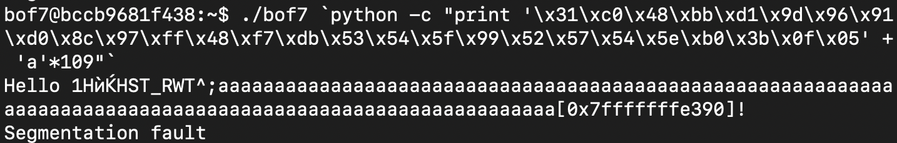
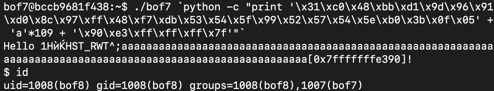

# GBC Security HW: BOF7



bof7.c 파일을 통해 

- 파일을 실행할 때 argument로 값을 받는다는 것 
- argument의 값을 vuln() 함수의 strcpy() 에서 buf로 넘기는 것 



vuln() 함수를 call할 때 rsp에 return address가 저장되어 있기 때문에 rsp의 알아낸다.



왠지는 모르겠지만 gdb로 한 줄씩 실행하다 보면 그냥 파일을 실행했을 때와는 다르게 중간에 `exit();`을 당해버린다.. 

그래서 `set $eflags |= (1<<6)`로 exit()를 넘어가준다. ~~만능키이다..~~



그렇게 오다보면 strcpy()에 도착하게 되고 여기서 buffer의 주소인 rdi의 값을 알 수 있다. 



return address에서 buffer의 주소를 빼면 136인 것을 알 수 있고 이는 곧 buffer에서 return address까지의 길이를 의미한다.

길이인 136에서 shellcode의 길이인 27을 빼면 109가 된다. 

파일을 실행했을 때의 buffer의 주소를 알아내기 위해 

```
$ ./bof7 `python -c "print '<SHELL CODE>` + 'a'*109"`
```
를 입력값으로 넣어준다. 



그러면 buf의 `주소인 0x7fffffffe390`을 알 수 있다.



이제 이를 little endian 으로 넣어주면 shell 실행 권한을 가져올 수 있다.
