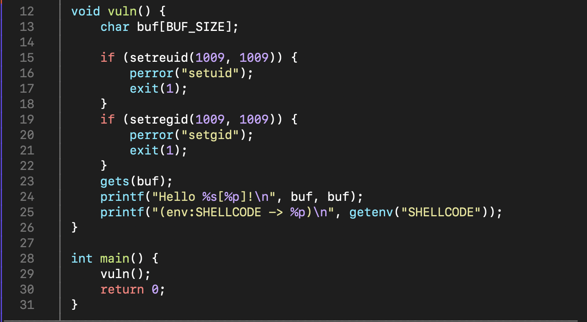
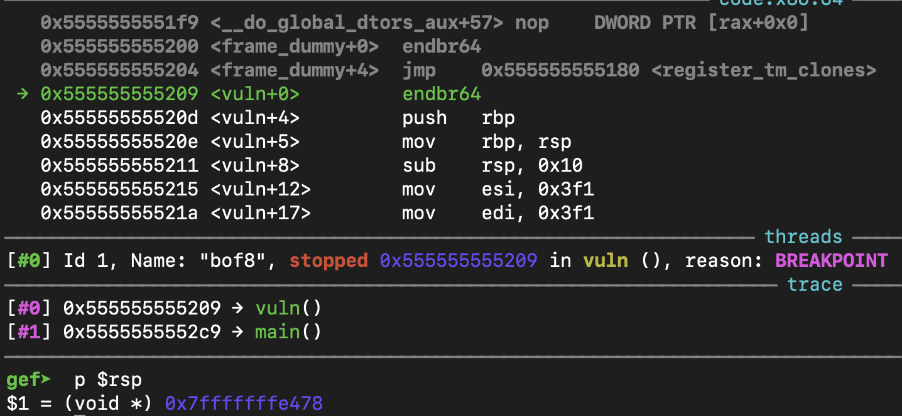
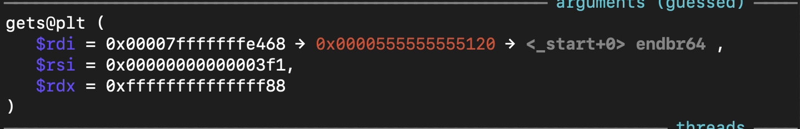
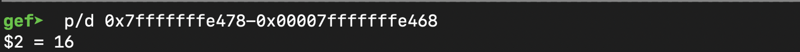
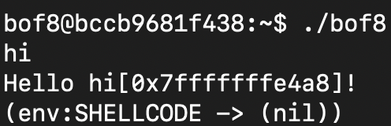
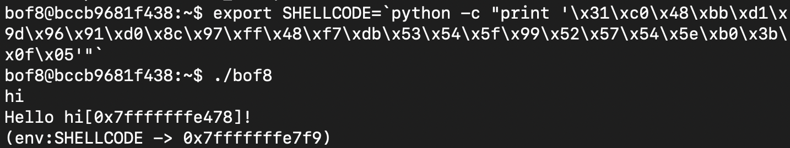
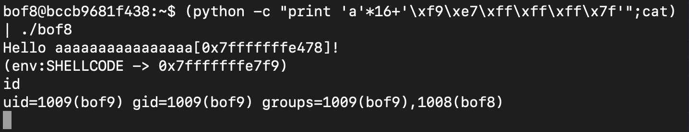

# GBC Security HW: BOF8

bof8.c 파일을 통해 

- 파일을 실행하여 gets()함수로 값을 받는다는 것 
- getenv()로 환경변수를 가져오는 것

vuln() 함수를 call할 때 rsp에 return address가 저장되어 있기 때문에 rsp의 알아낸다.

왠지는 모르겠지만 gdb로 한 줄씩 실행하다 보면 그냥 파일을 실행했을 때와는 다르게 중간에 `exit();`을 당해버린다.. 

그래서 `set $eflags |= (1<<6)`로 exit()를 넘어가준다. ~~만능키이다..~~

그렇게 오다보면 gets()에 도착하게 되고 여기서 buffer의 주소인 rdi의 값을 알 수 있다. 

return address에서 buffer의 주소를 빼면 16인 것을 알 수 있고 이는 곧 buffer에서 return address까지의 길이를 의미한다.

 

파일을 그냥 실행시켜보면 `SHELLCODE` 자리에는 아무것도 없음을 알 수 있다.

~~환경변수 설정을 안해줬기 때문에 당연한거다.~~

파일을 실행했을 때의 buffer의 주소를 알아내기 위해 

그래서 export 명령어로 SHELLCODE에 shellcode를 넣어준다. 

그리고 다시 파일을 실행시키면 환경변수의 위치가 출력된다. 

이제 길이인 16을 쓰레기 값으로 채우고 `SHELLCODE`의 위치를 little endian으로 해서 파일을 실행시키면 쉘 실행권한을 얻을 수 있다.

