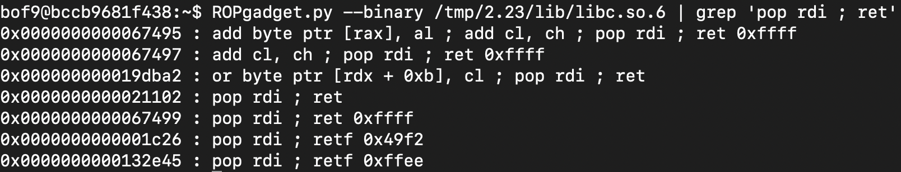

# GBC Security HW: BOF9

1. vuln()함수의 return address, buffer address

2. 길이 구하기

`vuln()함수의 return address - buffer address` 을 통해 사이의 거리가 16임을 알 수 있다. 

3. system 주소

4. '/bin/sh' 주소

`search-pattern /bin/sh` 을 통해 주소를 알아낼 수 있다. 

5. pop rdi ; ret 의 주소

`ROPgadget.py --binary /tmp/2.23/lib/libc.so.6 | grep 'pop rdi ; ret'` 를 통해 'pop rdi ; ret'의 주소를 알 수 있다. (이 주소는 libc 시작점의 주소와의 거리이다.)

6. ribc 주소

그러므로 `vmmap` 을 통해 libc의 주소를 알아내어 5번에서 구한 'pop rid ; ret'의 주소를 더한다. 

7. payload

이제 이를 바탕으로 payload를 작성해준다. `'a'*16 + <'pop rd; ret' address> + <'/bin/sh' address> + <system address>`  (구한 주소들을 6bytes이기 때문에 \x00으로 패딩을 채워준다. )

