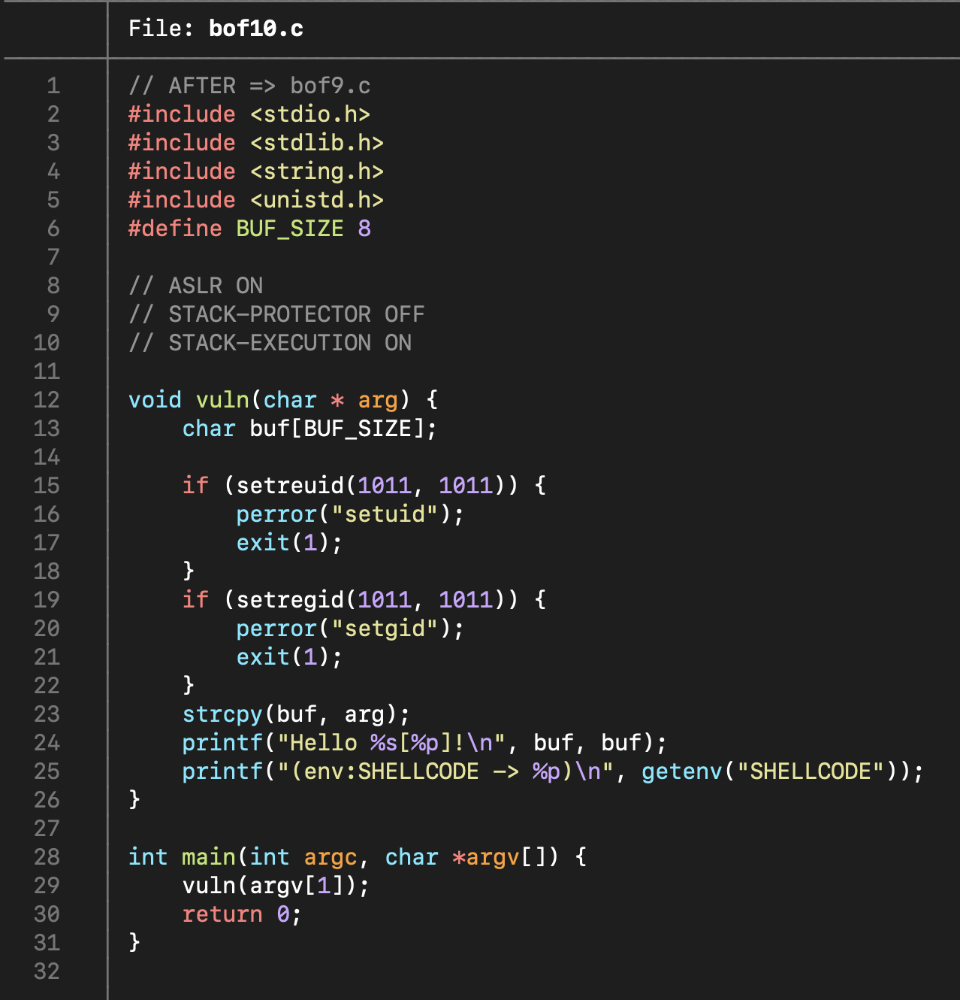
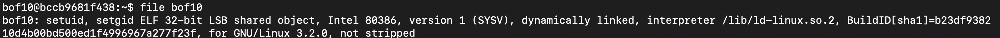
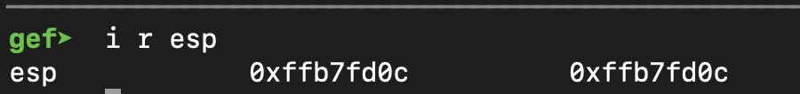
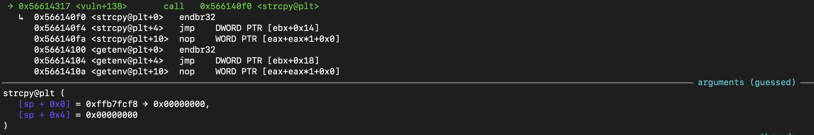
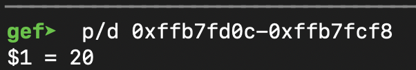
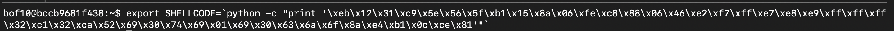
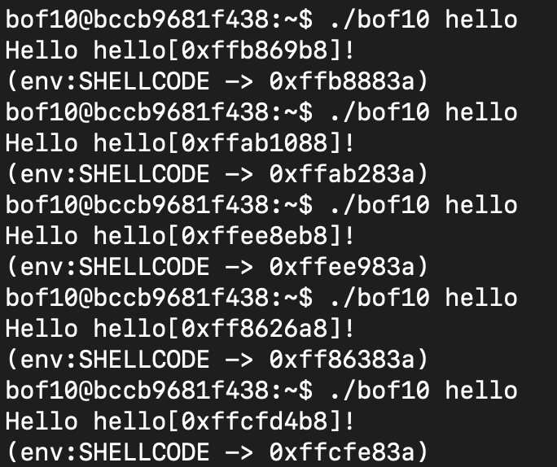
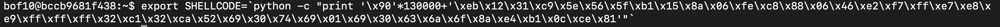
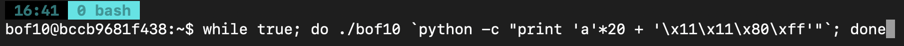
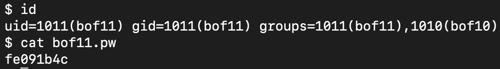

# GBC Security HW: BOF10

## 문제 풀이 

bof10.c 파일을 통해 
- 전체적인 형태는 '[BOF7](https://github.com/HDSeungJun/gbc_security_hw/blob/main/HW-7/bof7.md) + [BOF8](https://github.com/HDSeungJun/gbc_security_hw/blob/main/HW-7/bof8.md)
'의 모습이다. 

- 하지만 ASLR 보안 기법이 적용되어 있기 때문에 가상메모리의 주소값이 프로그램을 실행할 때마다 무작위로 변경된다는 점을 유의해야 한다.

를 알 수 있다.

본격적으로 리버싱을 하기 전에 bof10이 32bit file임을 확인한다.  

ASLR 기법이 적용되어 메모리 주소는 프로그램 실행마다 상이할 수 있지만 
어떤 한 주소에서 다른 어떤 한 주소, 즉 상대주소는 동일하다는 점을 명심해야 한다.

그러므로 Buf에서 부터 vuln() 함수의 return address 까지의 거리를 구해보자. 

프로그램을 gef로 실행 후 vuln 함수에 break를 걸고 실행하여 esp의 주소를 확인하여 vuln 함수의 return 주소를 알 수 있다.

instruction을 한 줄씩 실행시키다보면 strcpy()에서 buf의 주소를 알 수 있다.

그리고 그 둘의 차를 구하여 상대주소인 buf와 return 사이의 거리가 20임을 알 수 있다. 

이제 거리를 구하였으니 `SHELLCODE`의 주소를 구해보자. 환경변수인 `SHELLCODE`에 `\bin\sh`의 쉘 코드를 넣어준다. 

ASLR 기법이 적용되어있기 때문에 프로그램을 실행할 때마다 환경변수인 `SHELLCODE`의 주소가 변경되는 것을 확인할 수 있다.

(무작위로 변경되긴 하지만 범위는 대충 0xff800000 - 0xffffffff 인 것을 짐작할 수 있다.)

주소가 무작위로 변경되기 때문에 nop instruction을 적당히 집어 넣어 `SHELLCODE`의 주소를 정확하게 맞추지는 못하더라도 nop instruction을 타고 쉘 코드를 실행할 수 있도록 환경변수를 수정해준다. ~~말이 '적당히'지 안전빵을 위해 최대로 넣을 수 있는 13만 byte까지 넣어준다.~~ 

13만 byte의 nop instruction을 넣고 프로그램을 실행했을 때 쉘 코드의 도달할 확률을 구해보면 

`130000/(0xffffffff-0xff800000) * 100 = 1.549%`

이다. 이론적으로는 100번 실행하면 1번은 쉘 권한을 얻을 수 있다. 

하지만 귀찮다. 어느세월에 적어도 100번을 실행하고 앉아있겠는가...~~하지만 찬솔님은 그걸 시켰다...~~

그러므로 while 문을 작성하여 쉘 권한을 얻을 때까지 실행시켜보자.

얼마 후 쉘 권한을 얻을 수 있었으며 `bof11.pw`의 비밀번호를 알알냈다.

