# GBC Security HW: BOF11

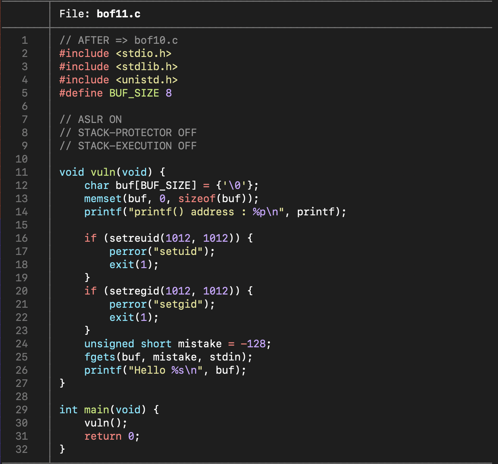

bof11.c 파일을 통해 

- ASLR 기법이 적용되어 있다. (`cat /proc/sys/kernel/randomize_va_space` 명령어를 통해서도 확인할 수 있음)

- 환경변수를 삽입하는 방식도 아니고 `system(/bin/sh)`도 코드에 없으므로 필요한 주소를 하나씩 모아 return address에 연결해야 하는 방식이다.

를 알 수 있다. 

(사진 첨부는 안되어 있지만 `bof11`은 64-bit 파일이다.)

[BOF10](https://github.com/HDSeungJun/gbc_security_hw/blob/main/HW-8/bof10.md) 에서도 언급했지만 ASLR 기법으로 인해 실행할 때마다 메모리 주소가 변경된다 하더라도 상대적인 주소, 즉 거리는 불변하다는 것을 명심해야 한다.

그러므로 printf()의 주소를 중심으로 하여 필요한 주소들과의 상대적인 주소를 구하려 한다.

필요한 주소들은 다음과 같다. 

- buf와 return address 사이의 거리 
- 'pop rdi ; ret' 명령의 주소 
- '/bin/sh' 문자열의 주소
- system 함수의 주소 

먼저 기준점이 되는 printf()의 주소를 구하자. (`p printf` 로도 구할 수 있다.)

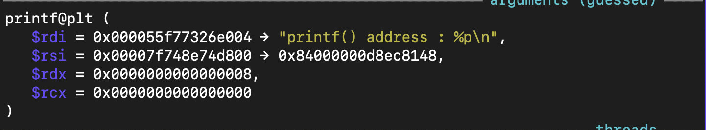

다음으로는 buf와 retrun address 사이의 거리를 구하려 한다. 

`i r rsp` 로 return address를 구하고 

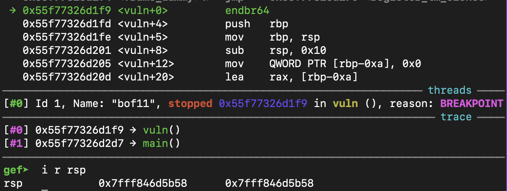

fgets() 에서 buf의 주소를 구하여 

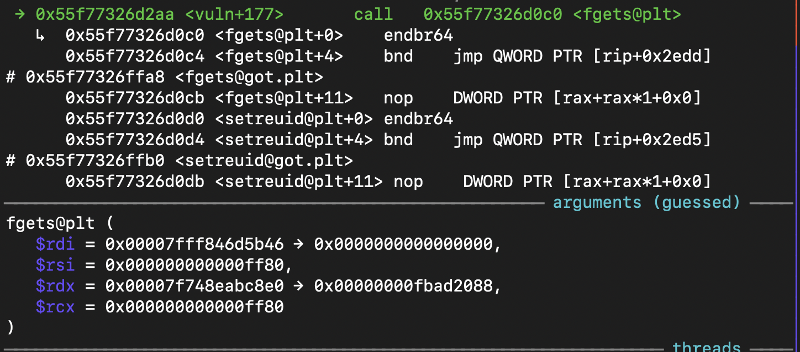

둘의 차를 구하여 거리를 알 수 있다. 

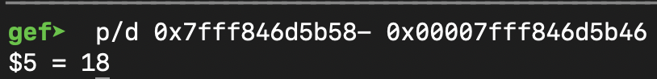

이제 `pop rdi ; ret` 문자열의 주소를 구하자. 

`vmmap`으로 libc의 주소를 구하고 

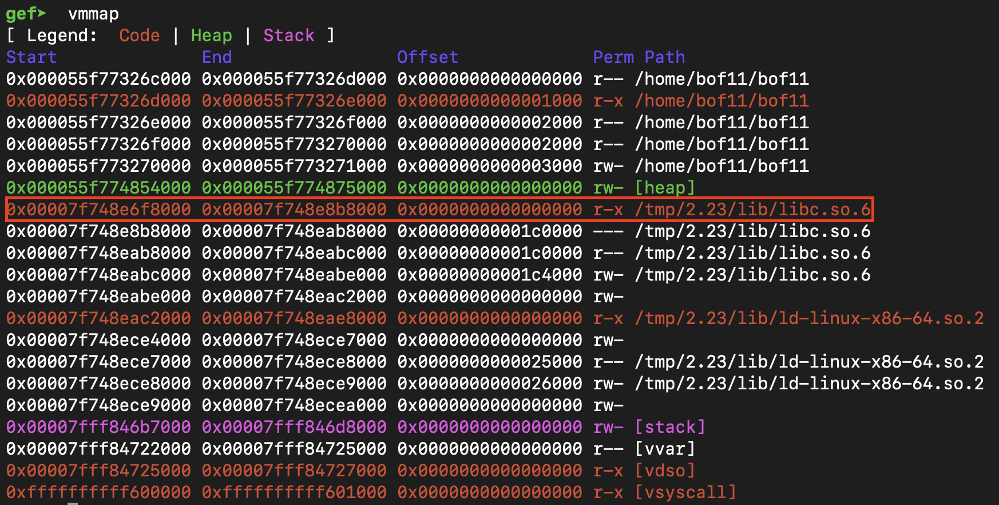

ROPgadget으로 'pop rdi ; ret'의 주소를 구하여 둘을 더하면 'pop rdi ; ret'의 실제 주소를 알 수 있다. 

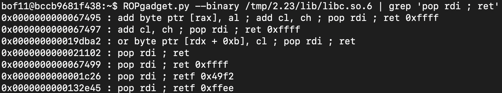

(ROPgadget의 주소는 프로그램 실행 전이나 후에 구하자. 중간에 프로그램을 종료하고 구하고 다시 실행하면 주소가 변경되기 때문에 이때까지 한 것들이 헛수고가 된다.)

다음으로 '/bin/sh' 문자열의 주소를 구한다. 

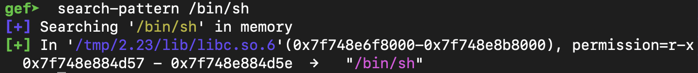

마지막으로 system 함수의 주소를 구한다. 

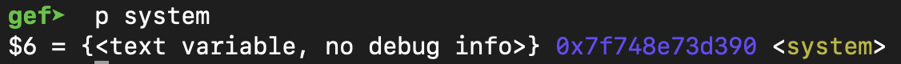

~~이제 드래곤볼의 위치를 다 알았으므로 실제로 찾기만 하면 된다.~~

이제 주소를 다 알아냈으니 printf()로부터의 거리를 구하자.

printf()와 

- `pop rdi ; ret`의 거리 

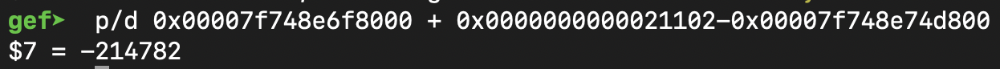

- `/bin/sh`의 거리 

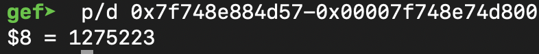

- system 함수의 거리 

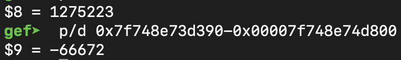

~~이제 드래곤볼을 모두 찾았으니 소원만 빌면 된다. (드래곤볼이 이렇게 흩어져 있었다면 손오공도 포기했을 거다...)~~~

이제 거리를 모두 구했으니 payload를 작성하여 프로그램을 실행시키면 된다. 

pwn tool을 이용하여 

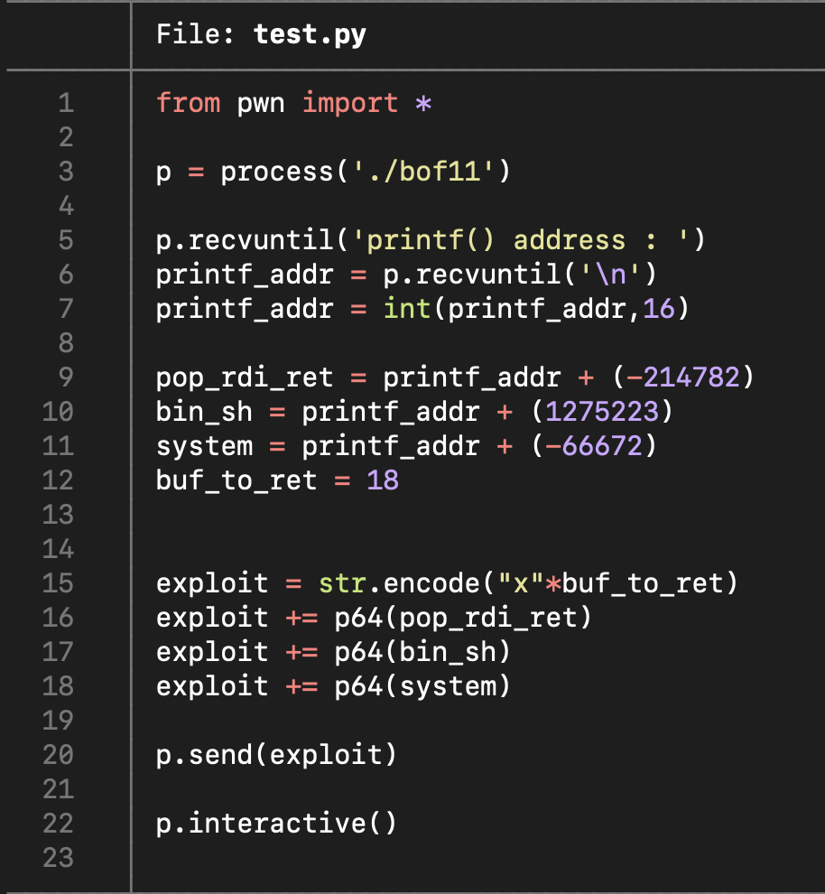

위와 같이 작성하여 실행시킨다. (`str.encode()`는 str과 byte간의 형 차이로 연산이 되지 않기 때문에 형변환을 해준 것이다.)

실행 결과, 쉘 권한을 얻을 수 있었다. 

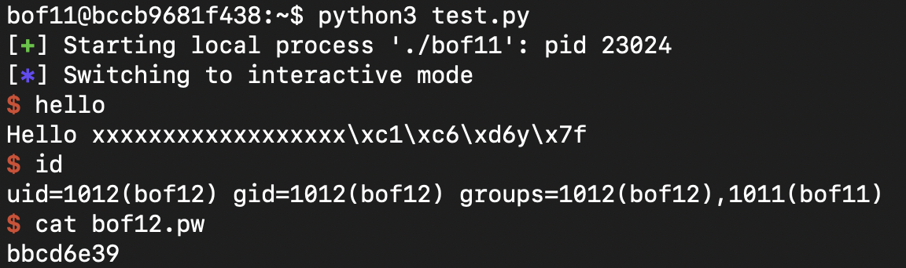

~~제 소원은 '남은 GBC 일정이 최소한 보안주차보다는 덜 빡세도록 해주세요.' 입니다.~~