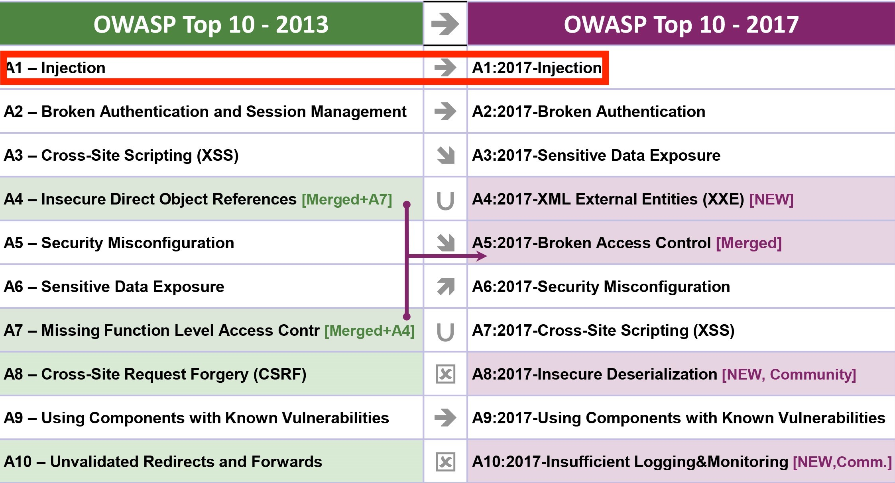

# GBC Security HW1
> 실제 사례를 찾아보자(택1)
> 유명한 해킹 사건 (역대로 있었던 유명한 해킹 사건을 1건 찾아서 간단하게 정리를 해옵시다)

## PlayStation Network 해킹 사건
---
1. 개요
- PlayStation Network(PSN): 플레이스테이션 이을 위한 네트워크 플랫폼, 온라인 멀티플레이어 게임 및 디지털 미디어 서비스 기능 제공
- 2011년 4월 27일부로 시작하여 7월에야 완료된 최악의 해킹사건

---
2. 사건일지
- 2011년 4월 17일 즈음에 PSN 서버에 정체불명 접근 발견
- 소니는 즉각 서버 다운 (온라인 대전을 포함한 모든 온라인 기능 먹통...)
- 서버 다운 후 3일이 지나서야 외부로부터 네트워크 해킹이 있었던 것을 인정
- 4월 27일, 소니에서 사용자들의 개인 정보가 유출되었음을 인정하며 공개사과
- 5월 중순이 되서야 일부 서비스 재개 

---
3. 피해규모
- 유저 (약 7700만)의 이름, 생년월일, 주소 등의 개인정보
- 유저 (약 1200만)의 신용카드 정보 
- PSN 계정의 아이디와 비밀번호
---
4. 취약점
- 이메일 주소를 계정으로 사용(유저입장에서는 동일 이메일 비밀번호로 설정할 확률이 높음)
- 개인정보가 비암호화 
- SQL 인젝션 결함(추정)
    >  소니 BMG 일본의 데이터베이스에 침투하는 것은 자동화된 SQL 인젝션 도구를 사용하면 단지 아이들 게임처럼 쉽다
    - [출처](https://www.itworld.co.kr/tags/1601/54634/70214)
---
5. SQL 인젝션
- 악의적인 SQL문을 실행되게 함으로써 데이터베이스를 비정상적으로 조작하는 코드 인젝션 공격 방법
- [OWASP Top10 중 1위](https://ko.wikipedia.org/wiki/OWASP#Top_Ten_Overview_(2017))

- 공격의 쉬운 난이도에 비해 파괴력이 어마어마함.
- 공격유형과 공격기법 
    1. SQL 인젝션 
        - 쿼리 무력화
        - 고의적 에러 유발 후 정보 유출
        - 시스템 명령어 실행
    2. Blind SQL 인젝션: 쿼리 결과의 참/거짓으로부터 DB값을 유출해 내는 기법
        - Boolean-based blind 공격
        - Time-based blind 공격

---
6. 관련 링크
- [PSN 해킹 사건](https://namu.wiki/w/PlayStation%20Network/사건사고?from=플레이스테이션%20네트워크%2F사건사고
)
- [OWASP](https://coconuts.tistory.com/96)
- [SQL Injection1](https://namu.wiki/w/SQL%20injection) 
- [SQL Injection2](https://m.mkexdev.net/427)